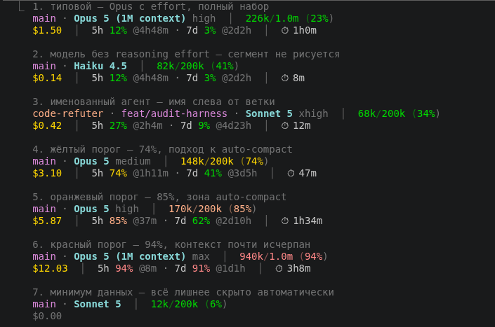
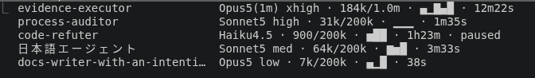

# Claude Code Statusline

Двухстрочная информационная панель для [Claude Code](https://docs.anthropic.com/en/docs/claude-code), отображающая в реальном времени состояние сессии прямо в терминале.



## Зачем это нужно

Claude Code не показывает ключевую информацию о текущей сессии. Без этого вы работаете вслепую:

- **Контекст заканчивается незаметно** — auto-compact срабатывает на ~80%, и вы не знаете, насколько близко к этому порогу. Statusline показывает процент использования с цветовыми порогами.
- **Rate limits непрозрачны** — на подписках Pro/Max есть лимиты на 5 часов и 7 дней. Statusline показывает текущий % использования и обратный отсчёт до сброса.
- **Стоимость сессии скрыта** — для API-ключей важно видеть расходы в реальном времени.

## Что отображается

```
Строка 1:  [agent] · [branch] · [model] [effort]  │  [used/limit (pct%)]
Строка 2:  [$cost]  │  [5h pct% @reset · 7d pct% @reset]  │  [⏱ duration]
```

Все элементы адаптивны — если данных нет, элемент скрывается автоматически.

### Effort

Приглушённый суффикс после модели — фактический уровень reasoning effort текущего хода, уже с учётом молчаливого понижения для выбранной модели. Это не то, что записано в конфиге: тот же источник, что переменная `$CLAUDE_EFFORT` для хуков и Bash. Полезно как индикатор — если уровень из настроек не применился, здесь это видно сразу.

```
main · Opus 5 (1M context) high  │  75k/1.0m (8%)
main · Haiku 4.5  │  82k/200k (41%)
```

Claude Code присылает поле только на моделях с поддержкой reasoning effort — на остальных (`claude-3-*`, Opus 4.0/4.1, Sonnet 4.0/4.5, вся линейка Haiku) сегмент не рисуется вовсе, а не показывается как «unknown».

### Цветовые пороги

Применяются к контексту и rate limits:

| Диапазон | Цвет      | Значение                            |
|----------|-----------|-------------------------------------|
| < 70%    | зелёный   | Комфортная зона                     |
| 70–79%   | жёлтый    | Приближение к auto-compact (~80%)   |
| 80–89%   | оранжевый | Зона auto-compact                   |
| >= 90%   | красный   | Критично, контекст почти исчерпан   |

## Панель фоновых агентов

Второй скрипт, `statusline-subagent.js`, декорирует строки фоновых агентов в панели задач (`Ctrl+B`). Дефолтная строка показывает имя, время и счётчик токенов; здесь к ним добавляются модель, effort, размер контекстного окна и спарклайн активности.



Слева Claude Code дорисовывает собственный статус-глиф — скрипт отвечает за всё, что после него.

| Элемент | Назначение |
|---------|------------|
| имя | выровнено в колонку шириной до 28 знакомест; на узкой панели колонка сжимается, лишнее обрезается многоточием |
| модель + effort | чего в дефолтной строке нет вовсе — видно, тем ли считает агент |
| токены / окно | текущий расход против лимита именно этой модели |
| спарклайн | активность по дельтам токенов между тиками |
| время | с момента запуска агента |
| статус | печатается, только если он не `running` — иначе дублировал бы глиф |

**Спарклайн — главное, чего нет в дефолте.** Он строится по приросту токенов между тиками, а не по абсолютным значениям, поэтому застрявший агент виден сразу: `▁▁▁` означает, что за всё окно наблюдения не было ни одного прироста. По дефолтной строке застрявший и работающий агенты неотличимы — счётчик токенов у обоих просто стоит на месте.

Две оговорки при чтении:

- Ровный `███` — это не застой, а наоборот, идеально равномерное потребление: все приросты равны максимуму. Дно (`▁▁▁`) и потолок (`███`) выглядят одинаково плоско, но означают противоположное.
- Высота нормируется по максимуму внутри своей строки, поэтому показывает характер активности, а не темп. Агент с приростами по 200 токенов даст такой же высокий столбик, как агент с приростами по 60 000. Абсолютную величину смотрите в соседнем поле с токенами.

Декорируются только фоновые (dispatched) агенты. Строки workflow и in-process teammates Claude Code рендерит по-своему.

**Размен:** декорация замещает строку целиком, поэтому счётчик `N queued` из дефолтного вида пропадает — этого поля во входных данных нет.

У скрипта есть тесты — 15 сценариев, включая выравнивание колонки при кириллице, CJK, составных эмодзи и комбинирующей диакритике:

```bash
node --test statusline-subagent.test.js
```

## Требования

- **Claude Code** >= 1.0.33 (поддержка `statusLine` в settings.json). Ключ `subagentStatusLine` проверен на 2.1.220
- **Node.js** >= 18
- Терминал с поддержкой true-color (RGB)

## Установка

### Автоматическая (рекомендуется)

Вставьте этот промпт в Claude Code:

```
Склонируй репозиторий https://github.com/nikitaCodeSave/Statusline_Claude-Code.git во временную директорию,
прочитай CLAUDE.md и выполни установку statusline.
После установки удали склонированный репозиторий и перечисли что было сделано.
```

### Ручная установка

<details>
<summary>Linux / macOS</summary>

```bash
git clone https://github.com/nikitaCodeSave/Statusline_Claude-Code.git
cd Statusline_Claude-Code
cp statusline.js statusline-subagent.js ~/.claude/
```

Добавьте в `~/.claude/settings.json`:

```json
{
  "statusLine": {
    "type": "command",
    "command": "node ~/.claude/statusline.js"
  },
  "subagentStatusLine": {
    "type": "command",
    "command": "node ~/.claude/statusline-subagent.js"
  }
}
```

Если файл уже содержит другие настройки, добавьте ключи к существующим. Панель фоновых агентов необязательна — можно поставить только `statusLine`. Перезапустите Claude Code.

</details>

<details>
<summary>Windows</summary>

```powershell
git clone https://github.com/nikitaCodeSave/Statusline_Claude-Code.git
cd Statusline_Claude-Code
copy statusline.js %USERPROFILE%\.claude\statusline.js
copy statusline-subagent.js %USERPROFILE%\.claude\statusline-subagent.js
```

Добавьте в `%USERPROFILE%\.claude\settings.json`:

```json
{
  "statusLine": {
    "type": "command",
    "command": "node ~/.claude/statusline.js"
  },
  "subagentStatusLine": {
    "type": "command",
    "command": "node ~/.claude/statusline-subagent.js"
  }
}
```

Если файл уже содержит другие настройки, добавьте ключи к существующим. Панель фоновых агентов необязательна — можно поставить только `statusLine`. Перезапустите Claude Code.

</details>

## Архитектура

```
settings.json
  ├── statusLine.command         → node ~/.claude/statusline.js           (две строки внизу)
  └── subagentStatusLine.command → node ~/.claude/statusline-subagent.js  (панель агентов)
```

Claude Code передаёт JSON на stdin при каждом обновлении и читает результат со stdout. `statusline.js` получает данные сессии и печатает две строки. `statusline-subagent.js` получает список фоновых задач и печатает NDJSON — по объекту `{id, content}` на задачу. Никаких хуков и зависимостей; второй скрипт можно не ставить.

## Лицензия

MIT
