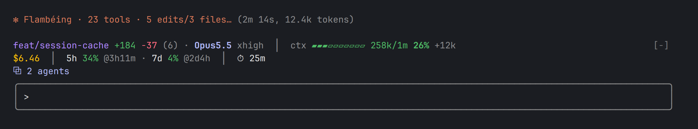
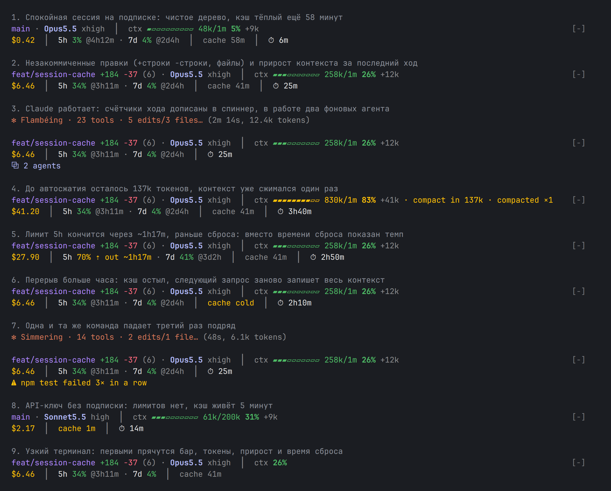

# loopline: статус сессии Claude Code

Мод для [Claude Code](https://code.claude.com/docs/en/plugins/mods/overview), который показывает состояние сессии в полосе над промптом и дописывает счётчики хода в спиннер. Он отвечает за отображение и только за него: ничего не запускает, не блокирует и не отвлекает.



## Зачем

Документация Anthropic называет контекст главным ограничением агентной работы и прямо советует следить за ним через статус-лайн ([best practices](https://code.claude.com/docs/en/best-practices), [context window](https://code.claude.com/docs/en/context-window)). Остальное в полосе — то, что обычно узнаёшь слишком поздно:

- **контекст** растёт с каждым ходом, а после сжатия часть его теряется навсегда;
- **prompt cache** остывает в перерыве, и следующий запрос заново записывает весь контекст;
- **лимиты подписки** кончаются раньше сброса, если тратить их быстрее среднего;
- **незакоммиченные правки** копятся, хотя маленькие порции и частые коммиты проще ревьюить.

## Что показывает

```
Полоса, строка 1:  ветка +строки −строки (файлы) · модель effort  │  ctx бар токены/окно % прирост · compact in N · compacted ×N
Полоса, строка 2:  $стоимость  │  5h % @сброс · 7d % @сброс  │  cache Nm  │  ⏱ длительность
Полоса, строка 3:  ⧉ N agents  │  ⚠ команда failed N× in a row
Спиннер:           ✻ Flambéing · N tools · N edits/N files… (время и токены рисует Claude Code)
```

Каждый элемент появляется, только когда ему есть что сказать:

| Элемент | Что значит | Когда виден |
|---|---|---|
| `main +184 −37 (6)` | ветка и незакоммиченные правки относительно `HEAD`: добавленные и удалённые строки, в скобках число изменённых и новых файлов | ветка всегда, правки при грязном дереве |
| `Opus5.5 xhigh` | модель и effort, **реально применённые** к последнему запросу, уже после возможного тихого понижения | всегда |
| `ctx ▰▰▰▱▱ 258k/1m 26%` | заполнение контекста; цвет: зелёный до 70%, жёлтый до 85%, дальше красный | всегда |
| `+12k` | на сколько контекст вырос за последний ход (после сжатия будет минус) | после хода |
| `compact in 137k` | сколько токенов осталось до автосжатия | в последней пятой части пути до него |
| `compacted ×1` | контекст уже сжимался, часть деталей потеряна: повод начать заново через `/clear` | после первого сжатия до `/clear` |
| `$6.46` | стоимость сессии | всегда |
| `5h 34% @3h11m` | расход лимита и время до сброса | на подписке |
| `⇡ out ~1h17m` | при текущем темпе лимит кончится раньше сброса; заменяет время сброса | только в этом случае, не раньше 5% окна и 10% расхода |
| `cache 41m` / `cache cold` | сколько ещё тёплый prompt cache (1 час на подписке, 5 минут на API) | в простое, после первого ответа |
| `⏱ 25m` | длительность сессии | всегда, если влезает |
| `⧉ 2 agents` | фоновые агенты в работе | пока они есть |
| `⚠ npm test failed 3× in a row` | один и тот же вызов падает подряд: агент, возможно, ходит по кругу | до начала следующего хода |
| спиннер `· 23 tools · 5 edits/3 files` | что основной цикл успел сделать за текущий ход | пока Claude работает |

Ещё мод показывает всплывающие уведомления внутри Claude Code, по одному при пересечении порога: контекст 70% и 85%, лимиты 80% и 95%.

## Состояния



Картинки отрисованы настоящим кодом мода (`hooks/format.ts`) скриптом `scripts/render-screens.ts`. Цвета приближены к тёмной теме Claude Code; в вашем терминале цвета берутся из выбранной темы.

На узком терминале строки не переносятся. Первыми исчезают второстепенные части: бар, токены, прирост, время сброса, `⏱`. Проценты и предупреждения остаются.

## Чего мод не делает

У мода одна ответственность: состояние сессии Claude Code. Всё, что относится к проекту или к вашему вниманию, остаётся за другими механизмами:

- **Тесты и проверки** определяют правила проекта: `CLAUDE.md`, хуки в `.claude/settings.json` проекта, `/goal`, CI. Мод их не запускает, не оценивает и не отображает.
- **Запреты опасных команд** задаются permission rules и защитой веток.
- **Desktop-уведомлений, кнопок и панелей нет:** полоса только сообщает.

## Установка

Нужен Claude Code **2.1.287+** в терминале или **2.1.286+** в Desktop-приложении. Node.js не нужен: мод исполняет сам Claude Code.

В сессии Claude Code:

```
/plugin install loopline --marketplace nikitaCodeSave/Statusline_Claude-Code
```

Подтвердите добавление marketplace (`y`), выберите scope `user`. Если откроется экран настроек, значение по умолчанию подходит. Мод начинает работать сразу, перезапуск не нужен.

Или из шелла:

```bash
claude plugin marketplace add nikitaCodeSave/Statusline_Claude-Code
claude plugin install loopline@nikitacodesave
```

Если сессия уже открыта, выполните в ней `/reload-plugins`. Проверка: `/plugin` показывает строку `1 mod active · loopline`.

### Переход со старого statusline

Раньше этот репозиторий был командным статус-лайном (`statusline.js` и `statusline-subagent.js`). Мод его заменяет; если оставить оба, информация будет дублироваться.

1. Удалите ключи `statusLine` и `subagentStatusLine` из `~/.claude/settings.json`.
2. Удалите `~/.claude/statusline.js` и `~/.claude/statusline-subagent.js`.

### Настройка

| Параметр | По умолчанию | Что делает |
|---|---|---|
| `stuckThreshold` | 3 | сколько раз подряд должен упасть один и тот же вызов, чтобы появилось `⚠` |

Меняется в `/config` или командой `/plugin configure loopline@nikitacodesave`.

## Где работает

| Где | Мод работает | Полоса видна |
|---|---|---|
| `claude` в терминале, включая терминалы редакторов и JetBrains | да | да |
| Desktop-приложение, вкладка Code (кроме WSL-сессий) | да | да |
| VS Code (панель чата), `claude -p`, Agent SDK, облачные сессии | да | нет: там ничего не рисуется |

Отключить: `/plugin` → вкладка **Installed**. На одну сессию все моды отключает `claude --safe-mode`.

## Безопасность

Моды выполняются внутри Claude Code с вашими правами и без песочницы, поэтому стоит знать, что именно делает этот. `claude plugin validate .` перечисляет все вызовы мода:

- **из Claude Code** читает модель, настройку effort, заполнение контекста, стоимость, лимиты, порог автосжатия и список агентов;
- **внешние процессы** только `git branch`, `git rev-parse`, `git status` и `git diff --shortstat` в рабочей папке сессии;
- **никогда** не обращается к сети и не пишет файлы. Хуки на события только наблюдают и не меняют ни промпты, ни вызовы инструментов, ни ответы; рисуют только два: полосу и суффикс спиннера.

## Разработка

```bash
claude --plugin-dir .                                         # загрузить мод из рабочей копии; правки подхватываются сами
claude plugin validate .                                      # статическая проверка, как при загрузке
claude plugin test                                            # тесты из tests/
node --experimental-strip-types scripts/render-screens.ts     # перерисовать img/ (Node 22.6+, Chrome)
```

При загрузке через `--plugin-dir` Claude Code кладёт типы API своей версии в `.claude-plugin/types/`, после этого `tsc -p .` проверяет типы. API модов в статусе early access и меняется между версиями. Мод проверен на Claude Code 2.1.291.

## Лицензия

MIT
